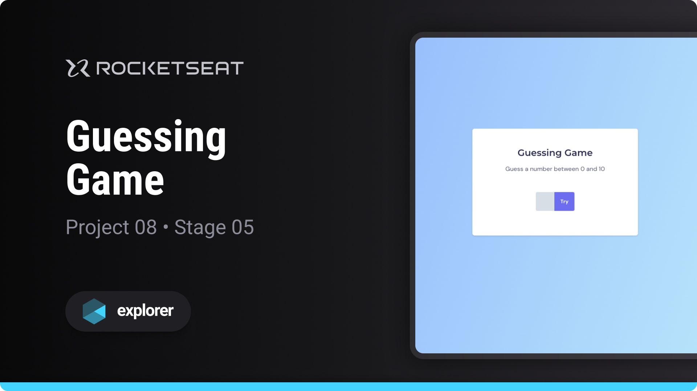

# Guessing Game

Project developed on Rocketseat's Explorer course

**Guessing Game is a game designed to learn basic JavaScript programming concepts**

## 🔗 Project Links

- 🚀 [**Deploy**](https://emanueltavecia.github.io/guessing-game)
- 🎨 [**Figma**](https://www.figma.com/file/5pZNHokTKTvld18xVAbk5C/Jogo-Adivinha%C3%A7%C3%A3o/duplicate)

## 📋 Project information

- Rocketseat Explorer
- Stage 05
- Project 08

## 🧠 Concepts learned

The development of this project aims to learn the following concepts:

- DOM Manipulation
- Events and Interactivity
- if, else, if else conditions
- functions

## 💻 Technologies

## 📄 License

This project is licensed under the MIT License - see the [LICENSE](./LICENSE) file for more details.
